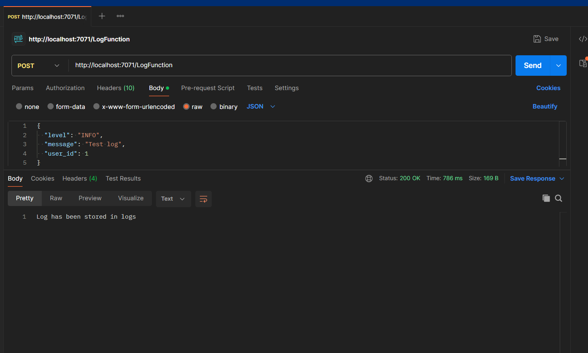
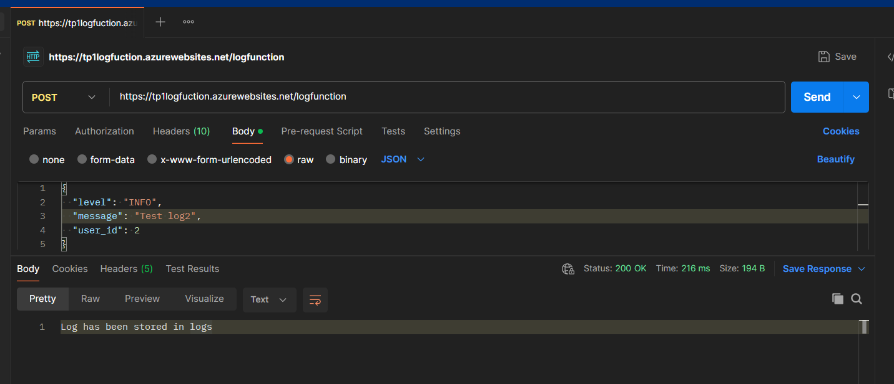

# Azure Functions Project

## 1. HelloWorld HTTP Trigger Function

### Description
Cette fonction Azure est une simple fonction HTTP Trigger qui renvoie un message "Hello World". Elle sert à valider la configuration initiale d'une fonction Azure.

### Étapes
- Création d'une Function App dans Azure via CLI :
  ```bash
  az functionapp create --resource-group <ResourceGroup> --consumption-plan-location <Location> --runtime python --functions-version 3 --name <FunctionAppName> --storage-account <StorageAccount>
  ```
- Création de la fonction HTTP trigger en local :
  ```bash
  func new --name HttpTrigger --template "HTTP trigger" --authlevel "anonymous"
  ```
- Déploiement de la fonction :
  ```bash
  func azure functionapp publish <FunctionAppName>
  ```

### Capture d'écran


---

## 2. Log Function

### Description
Cette partie implique une fonction Azure qui interagit avec un service de stockage pour gérer des logs. Nous avons intégré un stockage Azure Blob pour sauvegarder et récupérer des fichiers de logs.

### Étapes
- Création d'un compte de stockage dans Azure :
  ```bash
  az storage account create --name <StorageAccount> --location <Location> --resource-group <ResourceGroup> --sku Standard_LRS
  ```
- Configuration de la fonction log avec intégration du service Blob Storage :
  - Ajout de l'accès au compte de stockage dans `local.settings.json`.
  - Création de la fonction en local :
    ```bash
    func new --name LogFunction --template "Blob trigger"
    ```
- Déploiement de la fonction avec la commande :
  ```bash
  func azure functionapp publish <FunctionAppName>
  ```

### Captures d'écran
- Configuration de la fonction (insertion des logs) : 
- Exécution et récupération des logs : 


---

## 3. API CRUD avec Cosmos DB

### Description
L'API CRUD gère des données d'utilisateurs stockées dans une base de données Cosmos DB. Les actions incluent la création, la lecture, la mise à jour et la suppression d'entrées dans la base de données.

### Étapes

1. **Création de la base de données Cosmos DB :**
   ```bash
   az cosmosdb create --name <CosmosDbName> --resource-group <ResourceGroup> --locations regionName=<Location>
   az cosmosdb sql database create --account-name <CosmosDbName> --name <DatabaseName> --resource-group <ResourceGroup>
   ```

2. **Configuration du container utilisateur :**
   ```bash
   az cosmosdb sql container create --account-name <CosmosDbName> --database-name <DatabaseName> --name <ContainerName> --partition-key-path "/id"
   ```

3. **Création de l'API dans Azure Functions :**
   - Ajout des secrets dans `local.settings.json` (clé Cosmos DB, endpoint).
   - Implémentation des routes API (`GET`, `POST`, `PUT`, `DELETE`).

4. **Déploiement de l'API :**
   ```bash
   func azure functionapp publish <FunctionAppName>
   ```

### Captures d'écran
- Configuration et création de la base de données : 
- Fonction CRUD avec Cosmos DB :
bash
```
import json
import os
import logging
import azure.functions as func
from azure.cosmos import CosmosClient, exceptions

# Connexion à Cosmos DB via la chaîne de connexion
COSMOS_DB_ENDPOINT = "https://tp2.documents.azure.com:443/"
COSMOS_DB_KEY = "bwDPbmiswDpBcxJBkbnc5hKpxujzuW50yRUO2fZoWH64fxLbx0VopEdzD0lEt8KRWUY8vYhQJHxzACDbPATvfg=="
DATABASE_NAME = 'users'
CONTAINER_NAME = 'user_data'

# Initialiser le client Cosmos DB
client = CosmosClient(COSMOS_DB_ENDPOINT, COSMOS_DB_KEY)
database = client.get_database_client(DATABASE_NAME)
container = database.get_container_client(CONTAINER_NAME)

def main(req: func.HttpRequest) -> func.HttpResponse:
    logging.info('Processing CRUD request.')

    try:
        # Si la méthode est POST, PUT, DELETE, récupère le JSON du corps
        request_json = None
        if req.method != 'GET':
            try:
                request_json = req.get_json()
                logging.info(f"Corps JSON de la requête : {request_json}")
            except ValueError:
                logging.error("Erreur : La requête ne contient pas de JSON valide")
                return func.HttpResponse("Invalid JSON", status_code=400)

        if req.method == 'GET':
            # Exécuter la requête pour obtenir tous les utilisateurs
            users = container.query_items(
                query="SELECT * FROM c",
                enable_cross_partition_query=True
            )
            return func.HttpResponse(json.dumps([user for user in users]), mimetype="application/json", status_code=200)

        elif req.method == 'POST':
            # Générer un nouvel ID utilisateur
            user_id = str(request_json.get('id'))  # Utiliser un id fourni
            user_data = request_json.get('data')

            container.create_item(body={"id": user_id, **user_data})
            return func.HttpResponse('User added!', status_code=201)

        elif req.method == 'PUT':
            user_id = str(request_json.get('id'))
            user_data = request_json.get('data')

            container.upsert_item(body={"id": user_id, **user_data})
            return func.HttpResponse('User updated!', status_code=200)

        elif req.method == 'DELETE':
            user_id = str(request_json.get('id'))

            # Vérifier si l'utilisateur existe avant de le supprimer
            user_exists = list(container.query_items(
                query="SELECT * FROM c WHERE c.id = @id",
                parameters=[{"name": "@id", "value": user_id}],
                enable_cross_partition_query=True
            ))

            if not user_exists:
                return func.HttpResponse(f"User with id {user_id} not found.", status_code=404)

            # Suppression de l'utilisateur en utilisant `id` comme partition_key
            container.delete_item(item=user_id, partition_key=user_id)
            return func.HttpResponse("User deleted!", status_code=200)

        else:
            return func.HttpResponse('Method not supported!', status_code=405)

    except exceptions.CosmosHttpResponseError as e:
        logging.error(f"Cosmos DB Error: {str(e)}")
        return func.HttpResponse(f"An error occurred: {str(e)}", status_code=500)

    except Exception as e:
        logging.error(f"Unexpected error: {str(e)}")
        return func.HttpResponse(f"An unexpected error occurred: {str(e)}", status_code=500)
```

- Test des requêtes API avec Postman : 

---


