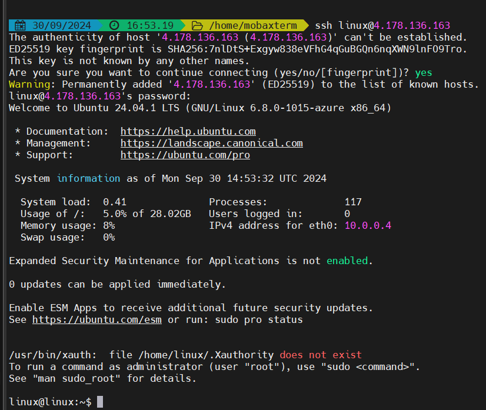
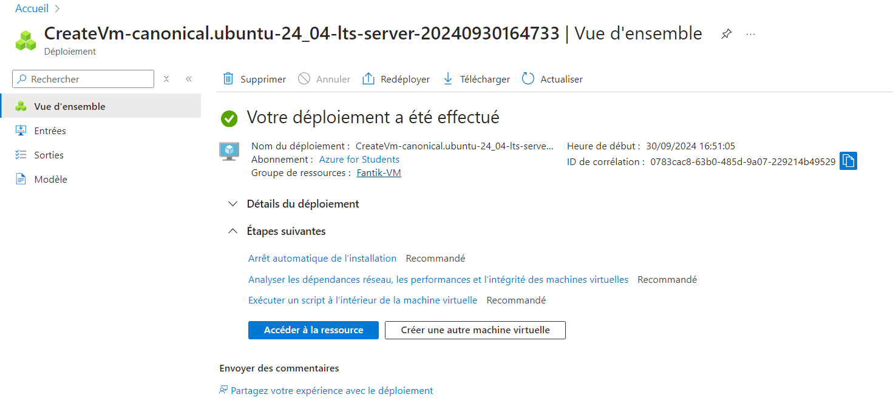
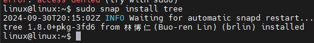

# Lab 1: Creating and Managing Azure Virtual Machines


## Étape 1 : Déployer une machine virtuelle Windows et Linux dans Azure

1. Accédez au portail Azure et créez une machine virtuelle **Windows** et une autre **Linux**.
   - Sélectionnez les options appropriées pour la taille, le système d'exploitation et le groupe de ressources.

**Capture d’écran** : 

### Commande Azure CLI équivalente pour déployer une VM Linux
```bash
az vm create   --resource-group <nom_du_groupe>   --name <nom_de_la_vm_linux>   --image UbuntuLTS   --admin-username <nom_utilisateur>   --generate-ssh-keys
```


## Étape 2 : Configurer la taille des VMs, les options de stockage et les paramètres réseau

1. Modifiez les tailles des VMs selon vos besoins (Standard_DS1_v2, etc.). Configurez le stockage et les paramètres réseau (VNet, sous-réseaux, IP publique).

**Capture d’écran** : 

### Commande Azure CLI pour redimensionner une VM
```bash
az vm resize   --resource-group <nom_du_groupe>   --name <nom_de_la_vm>   --size Standard_DS1_v2
```

---

## Étape 3 : Se connecter aux VMs via RDP (Windows) et SSH (Linux)

1. Pour la VM Windows, connectez-vous via **Remote Desktop Protocol (RDP)**.
2. Pour la VM Linux, connectez-vous via **SSH** en utilisant l'adresse IP publique.

**Capture d’écran** : 

### Commande SSH pour se connecter à une VM Linux
```bash
ssh <nom_utilisateur>@<adresse_ip_publique>
```

### Connexion RDP pour une VM Windows
1. Utilisez l'outil **Remote Desktop Connection** et entrez l'IP publique de la VM Windows.
2. Connectez-vous avec le nom d'utilisateur et mot de passe configurés lors du déploiement.

---

## Étape 4 : Installer des logiciels et prendre des instantanés

1. Installez des logiciels sur les VMs :
   - Pour Linux : Installez **nginx** en utilisant la commande suivante :
   ```bash
   sudo apt update && sudo apt install nginx -y
   ```
