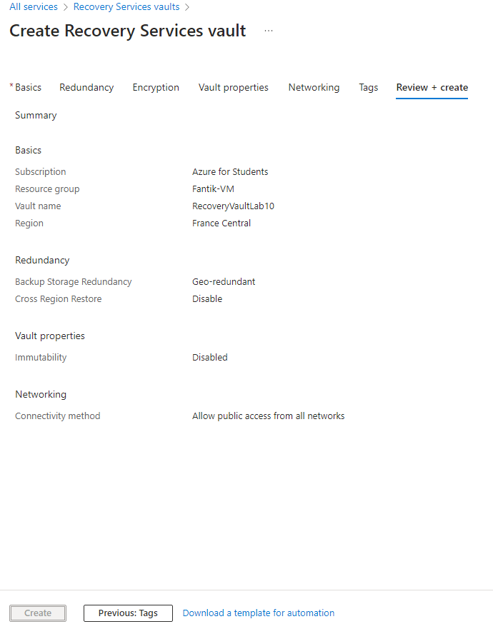
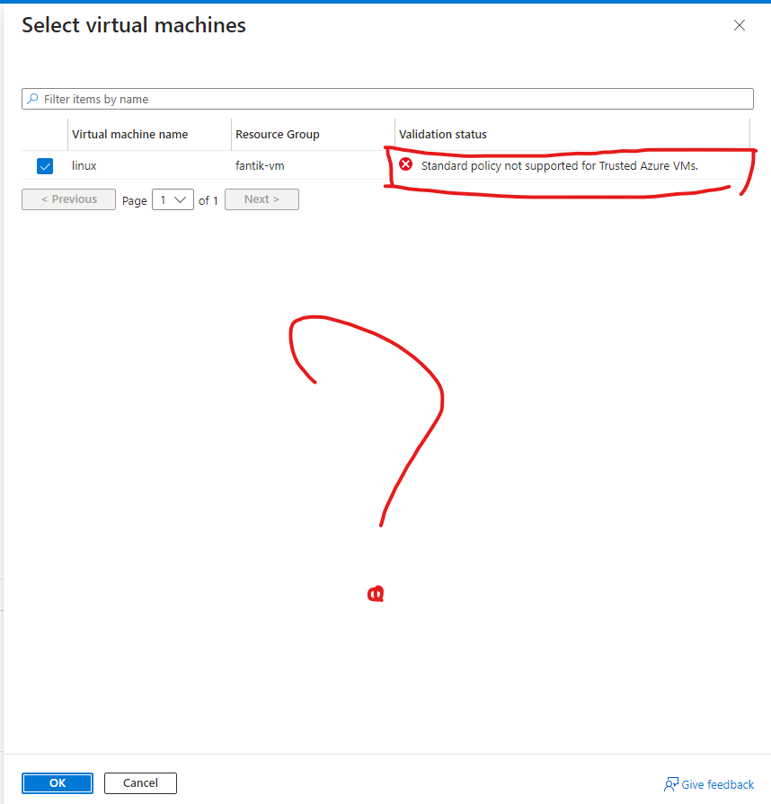
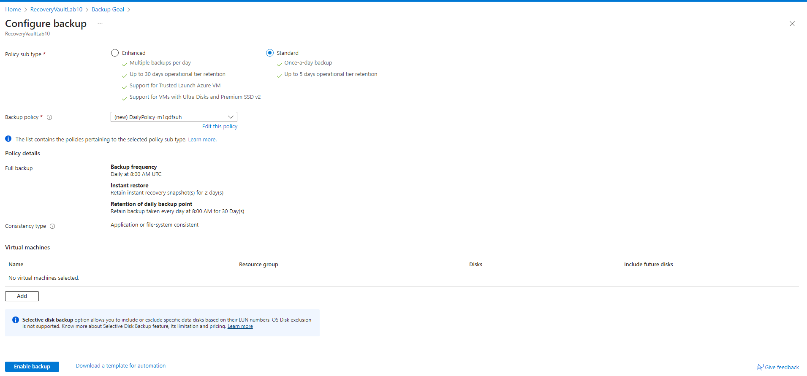
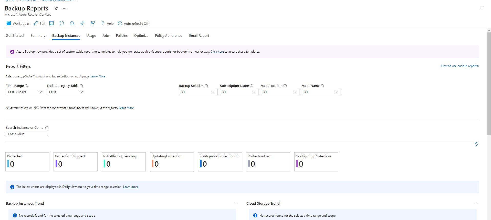

# Lab 10: Configuring Azure Backup and Recovery Services

## Étape 1 : Créer un Recovery Services Vault

1. Créez un **Recovery Services Vault** dans le portail Azure :
   - *Name* : `RecoveryVaultLab10`
   - *Region* : Sélectionner une région appropriée

**Capture d’écran** : 

### Commande équivalente (Azure CLI)
```bash
az backup vault create \
  --resource-group <nom_du_groupe> \
  --name RecoveryVaultLab10 \
  --location <region>
```

---

## Étape 2 : Configurer la sauvegarde pour les VMs et Azure Files

1. Configurez la sauvegarde pour des machines virtuelles ou des fichiers Azure dans le Recovery Services Vault.

**Capture d’écran** : 

### Commande équivalente (Azure CLI)
```bash
# Configurer la sauvegarde pour une VM
az backup protection enable-for-vm \
  --resource-group <nom_du_groupe> \
  --vault-name RecoveryVaultLab10 \
  --vm <nom_vm> \
  --policy-name DefaultPolicy
```

---

## Étape 3 : Effectuer une opération de sauvegarde et de restauration

1. Effectuez une sauvegarde manuelle et une restauration à partir du Recovery Services Vault.

**Capture d’écran** : 

---

## Étape 4 : Mettre en œuvre des politiques de sauvegarde et de rétention

1. Configurez des politiques de sauvegarde et de rétention dans le Recovery Services Vault.

**Capture d’écran** : 

---

