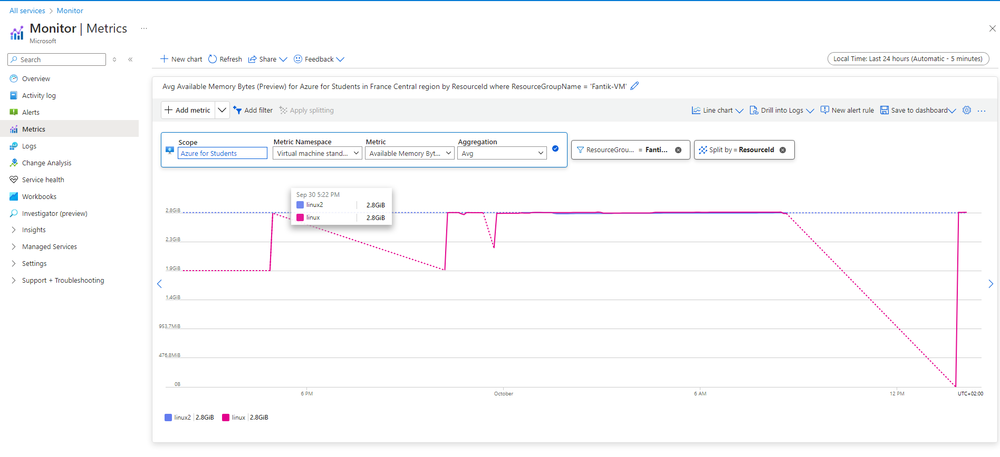
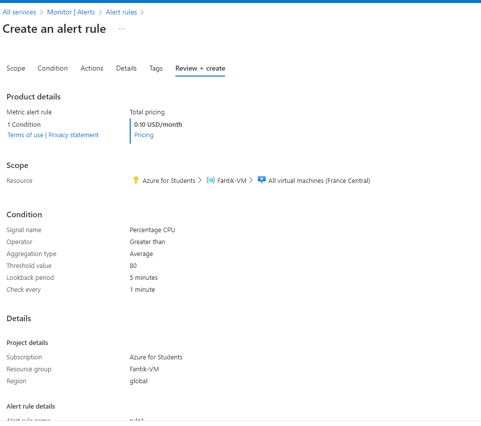
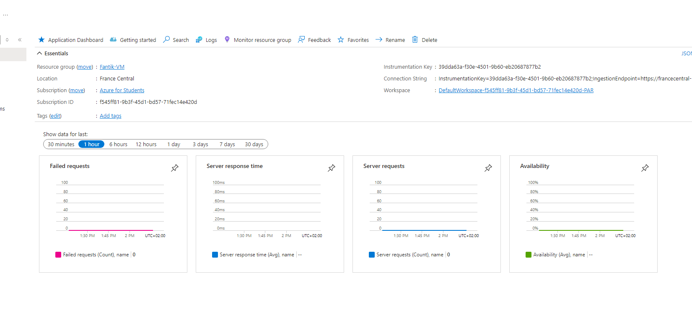
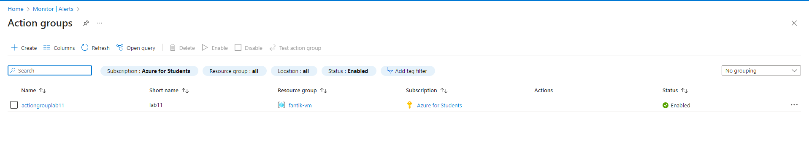

# Lab 11: Implementing Azure Monitor and Alerts

## Étape 1 : Configurer Azure Monitor pour collecter des métriques et des journaux

1. Sélectionnez des ressources dans **Azure Monitor** et configurez la collecte de métriques et de journaux pour surveiller leur état.

**Capture d’écran** : 

### Commande équivalente (Azure CLI)
```bash
# Exemple de commande pour activer la collecte de logs sur une VM
az monitor diagnostic-settings create \
  --resource <resource_id> \
  --name "Diagnostics" \
  --logs '[{"category": "Administrative", "enabled": true}]'
```

---

## Étape 2 : Créer des alertes basées sur les métriques

1. Créez des alertes dans **Azure Monitor** pour recevoir des notifications lorsque les seuils de métriques sont dépassés.

**Capture d’écran** : 

### Commande équivalente (Azure CLI)
```bash
az monitor metrics alert create \
  --name "CPUAlert" \
  --resource-group <nom_du_groupe> \
  --scopes <resource_id> \
  --condition "avg Percentage CPU > 80" \
  --description "Alerte lorsque le CPU dépasse 80%"
```

---

## Étape 3 : Visualiser les données avec des tableaux de bord

1. Utilisez des tableaux de bord dans Azure pour visualiser les données et surveiller les performances des ressources.

**Capture d’écran** : 

---

## Étape 4 : Mettre en œuvre des groupes d'action

1. Configurez des **Action Groups** pour recevoir des notifications d'alerte par e-mail ou SMS.

**Capture d’écran** : 

### Commande équivalente (Azure CLI)
```bash
az monitor action-group create \
  --resource-group <nom_du_groupe> \
  --name MyActionGroup \
  --short-name ActionGrp \
  --email-receiver email=myemail@example.com \
  --sms-receiver country-code=1 phone-number=1234567890
```

---
