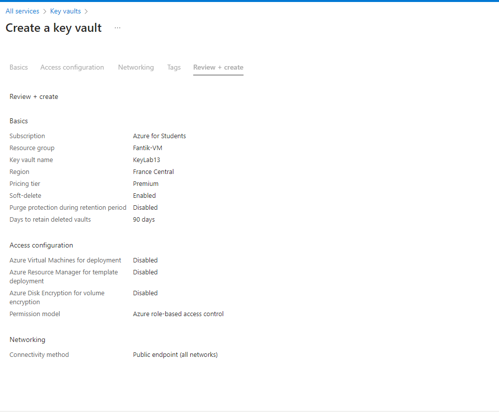

# Lab 13: Implementing Azure Key Vault


## Étape 1 : Créer un Azure Key Vault

1. Créez un **Azure Key Vault** dans le portail Azure :
   - *Name* : `KeyVaultLab13`
   - *Region* : Sélectionner une région appropriée
   - *Pricing tier* : Standard ou Premium


**Capture d’écran** : 

### Commande équivalente (Azure CLI)
```bash
az keyvault create \
  --name KeyVaultLab13 \
  --resource-group <nom_du_groupe> \
  --location <region> \
  --sku standard
```

---

## Étape 2 : Stocker et récupérer des secrets, clés, et certificats

1. Stockez un **secret**, une **clé**, ou un **certificat** dans le Key Vault et récupérez-le via l'interface ou avec le code suivant.

### Récupérer un secret avec Python
```python
from azure.identity import DefaultAzureCredential
from azure.keyvault.secrets import SecretClient

credential = DefaultAzureCredential()
key_vault_name = "KeyLab13"
KVUri = f"https://{key_vault_name}.vault.azure.net"

secret_client = SecretClient(vault_url=KVUri, credential=credential)
secret_name = "mySecret"
retrieved_secret = secret_client.get_secret(secret_name)
print(f"Your secret value is: {retrieved_secret.value}")
```

---

## Étape 3 : Intégrer Key Vault avec une application pour la gestion des secrets

1. Utilisez le SDK Azure pour intégrer Key Vault avec une application Python et gérer des secrets avec le code ci-dessus.

---

## Étape 4 : Configurer des politiques d'accès et la surveillance

1. Configurez les **Access Policies** pour définir qui peut accéder aux secrets et configurez la surveillance dans Azure Monitor.

### Commande Azure CLI pour configurer une politique d'accès
```bash
az keyvault set-policy \
  --name KeyLab13 \
  --resource-group <nom_du_groupe> \
  --object-id <object_id_user_or_app> \
  --secret-permissions get list
```

---

## Étape 5 : Utiliser une clé dans une application

1. Récupérez et utilisez une clé dans une application Python pour chiffrer des données.

### Utilisation d'une clé avec Python pour chiffrer un message
```python
from azure.identity import DefaultAzureCredential
from azure.keyvault.keys import KeyClient
from cryptography.hazmat.primitives.asymmetric import padding
from cryptography.hazmat.primitives import hashes

credential = DefaultAzureCredential()
key_vault_name = "KeyVaultLab13"
KVUri = f"https://{key_vault_name}.vault.azure.net"

key_client = KeyClient(vault_url=KVUri, credential=credential)
key_name = "myEncryptionKey"
key = key_client.get_key(key_name)

message = b"Hello from Azure Key Vault!"
ciphertext = key.key.encrypt(message, padding.OAEP(mgf=padding.MGF1(algorithm=hashes.SHA256()), algorithm=hashes.SHA256(), label=None))
print(f"Ciphertext: {ciphertext}")
```

---
