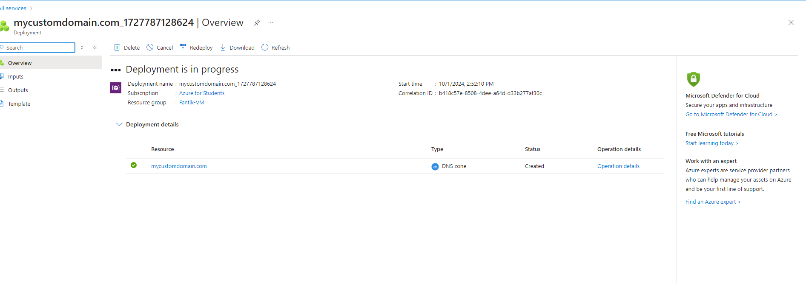
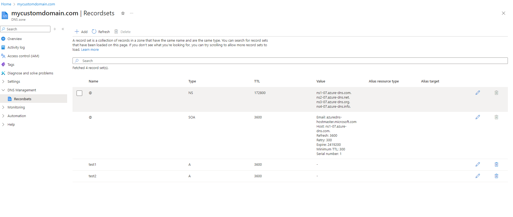
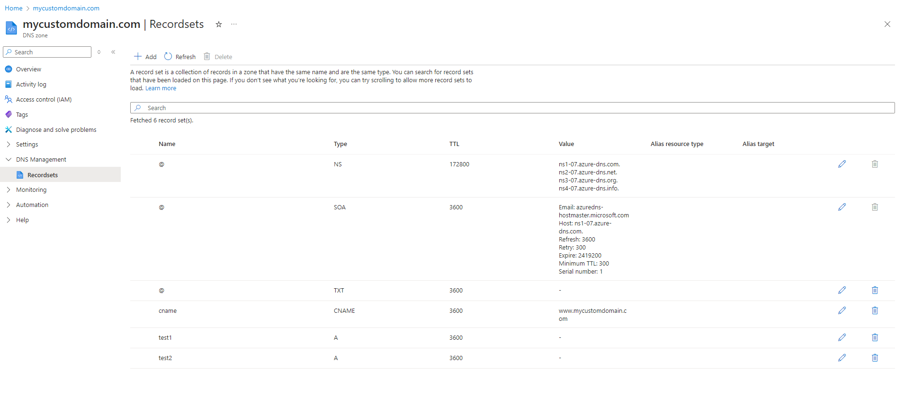

# Lab 14: Configuring Azure DNS and Custom Domains


## Étape 1 : Créer une Azure DNS Zone

1. Créez une **DNS Zone** dans le portail Azure :
   - *Name* : `mycustomdomain.com`
   - *Resource Group* : Sélectionner un groupe de ressources


**Capture d’écran** : 

### Commande équivalente (Azure CLI)
```bash
az network dns zone create \
  --resource-group <nom_du_groupe> \
  --name mycustomdomain.com
```

---

## Étape 2 : Gérer les enregistrements DNS pour un domaine personnalisé

1. Ajoutez des **enregistrements DNS** (A, CNAME, MX, etc.) dans la zone DNS.


**Capture d’écran** : 

### Ajouter un enregistrement test1 et test2
```bash
az network dns record-set a add-record \
  --resource-group <nom_du_groupe> \
  --zone-name mycustomdomain.com \
  --record-set-name "@" \
  --ipv4-address <adresse_ip_du_serveur>
```

---

## Étape 3 : Configurer la vérification de domaine et le mappage pour les services Azure

1. Ajoutez un **enregistrement TXT** pour prouver que vous possédez le domaine, puis mappez-le à un service Azure comme une Web App.

### Commande pour ajouter un enregistrement TXT
```bash
az network dns record-set txt add-record \
  --resource-group <nom_du_groupe> \
  --zone-name mycustomdomain.com \
  --record-set-name "@" \
  --value "azure-site-verification=<verification_code>"
```

---

## Étape 4 : Implémenter des alias DNS (CNAME) et des jeux d'enregistrements

1. Créez un enregistrement **CNAME** pour un alias DNS et gérez des jeux d'enregistrements pour plusieurs adresses.

### Ajouter un enregistrement CNAME
```bash
az network dns record-set cname set-record \
  --resource-group <nom_du_groupe> \
  --zone-name mycustomdomain.com \
  --record-set-name "www" \
  --cname mycustomdomain.com
```


**Capture d’écran** : 

---
