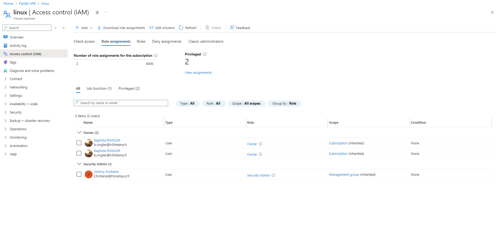
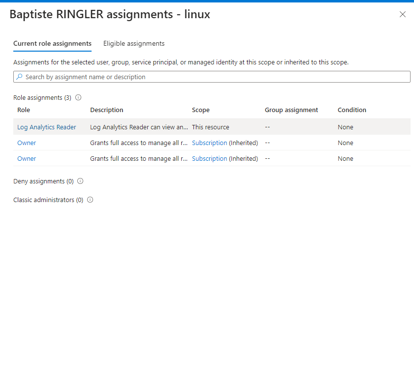
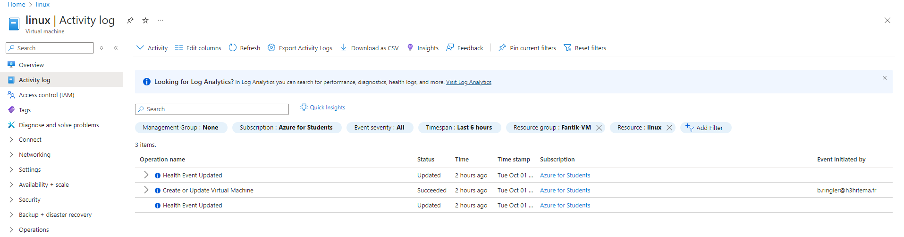

# Lab 16: Managing Role-Based Access Control (RBAC)

## Étape 1 : Attribuer des rôles intégrés aux utilisateurs et aux groupes

1. Attribuez un rôle intégré comme **Owner**, **Contributor**, ou **Reader** à un utilisateur ou un groupe dans **Access Control (IAM)**.


**Capture d’écran** : 

### Commande équivalente (Azure CLI)
```bash
az role assignment create \
  --assignee <user_email_or_object_id> \
  --role "Contributor" \
  --scope /subscriptions/<subscription_id>/resourceGroups/<resource_group_name>
```

---

## Étape 2 : Créer des rôles personnalisés avec des permissions spécifiques

1. Créez un rôle personnalisé dans **Access Control (IAM)** et définissez des permissions spécifiques.

**Capture d’écran** : 


### Exemple de JSON pour un rôle personnalisé
```json
{
  "Name": "Custom VM Operator",
  "IsCustom": true,
  "Description": "Can manage VMs except for permissions",
  "Actions": [
    "Microsoft.Compute/virtualMachines/start/action",
    "Microsoft.Compute/virtualMachines/restart/action",
    "Microsoft.Compute/virtualMachines/read"
  ],
  "AssignableScopes": ["/subscriptions/<subscription_id>"]
}
```

---

## Étape 3 : Tester les niveaux d'accès pour différents rôles

1. Connectez-vous avec différents utilisateurs et testez les niveaux d'accès en fonction des rôles assignés.

---

## Étape 4 : Auditer l'accès à l'aide des journaux d'activité

1. Utilisez les **Activity Logs** pour auditer les actions effectuées par les utilisateurs avec des rôles spécifiques.


**Capture d’écran** : 

---


