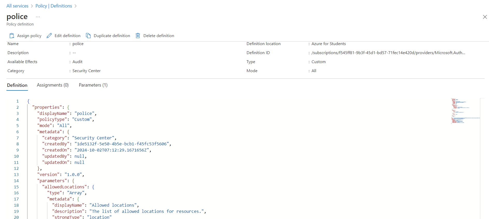
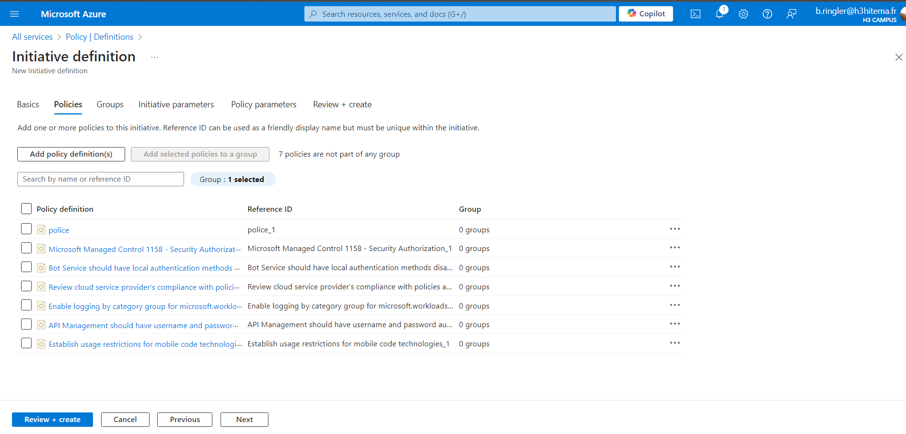

# Lab 17: Implementing Azure Policy and Governance

## Étape 1 : Créer et affecter des politiques Azure

1. Créez et affectez une politique pour restreindre les emplacements de création des ressources.
   
**Capture d’écran** : 

### Commande Azure CLI équivalente
```bash
az policy assignment create \
  --name "AllowedLocations" \
  --policy "/providers/Microsoft.Authorization/policyDefinitions/<policy_id>" \
  --params '{"allowedLocations": {"value": ["East US", "West US"]}}' \
  --scope "/subscriptions/<subscription_id>"
```

---

## Étape 2 : Utiliser des initiatives pour regrouper plusieurs politiques

1. Créez une initiative pour appliquer plusieurs politiques, telles que la restriction des emplacements et la taille des VM.

**Capture d’écran** : 


### Commande Azure CLI équivalente
```bash
az policy set-definition create \
  --name "SecureInitiative" \
  --definitions '[{"policyDefinitionId": "/providers/Microsoft.Authorization/policyDefinitions/<policy1_id>"},{"policyDefinitionId": "/providers/Microsoft.Authorization/policyDefinitions/<policy2_id>"}]' \
  --params '{"allowedLocations": {"value": ["East US", "West US"]}}'
```

---


## Étape 3 : Remédier aux ressources non conformes

1. Remédiez aux ressources non conformes automatiquement ou manuellement à l'aide des outils de remédiation Azure.

### Commande Azure CLI équivalente
```bash
az policy remediation create \
  --name "RemediateNonCompliantResources" \
  --policy-assignment "/subscriptions/<subscription_id>/providers/Microsoft.Authorization/policyAssignments/<policy_assignment_id>" \
  --resource-discovery-mode ReEvaluateCompliance
```

## Étape 4 : Analyser les rapports de conformité
Analysez les rapports de conformité dans le panneau Policy pour identifier les ressources non conformes et prendre les mesures appropriées.
