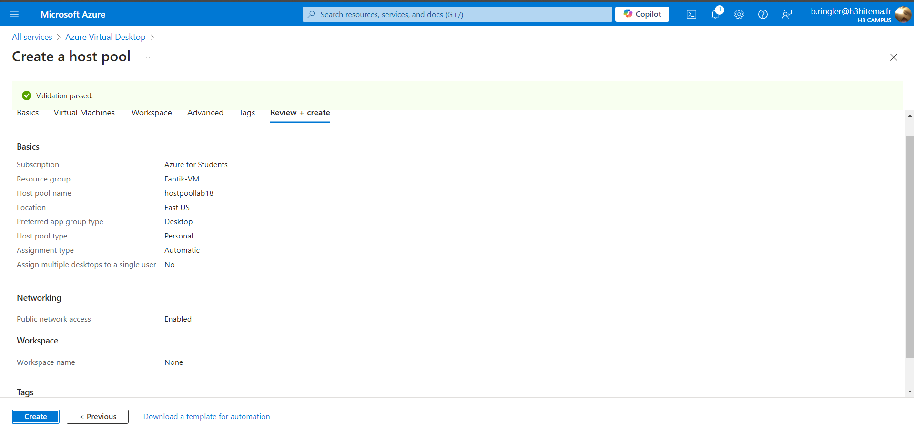
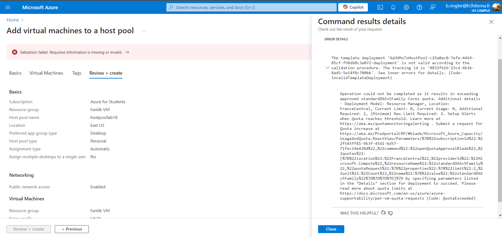
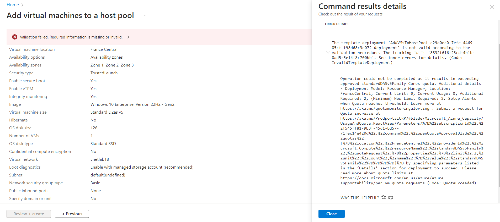

# Lab 18: Configuring Azure Virtual Desktop


## Étape 1 : Configurer l'environnement Azure Virtual Desktop

1. Créez un **Host Pool** dans le portail Azure pour gérer les sessions utilisateur.

**Capture d’écran** : 

### Commande équivalente (Azure CLI)
```bash
az desktopvirtualization hostpool create     --resource-group <nom_du_groupe>     --name <nom_du_hostpool>     --location <region>     --friendly-name "Host Pool Lab18"     --description "Host Pool for Azure Virtual Desktop Lab"
```

---

## Étape 2 : Configurer les pools d'hôtes, les hôtes de session, et les espaces de travail

1. Ajoutez des **Session Hosts** (machines virtuelles) pour héberger les sessions utilisateur.
2. Créez un **Workspace** pour regrouper les bureaux et applications publiés.

**Capture d’écran** : 
**Capture d’écran** : 

### Commande équivalente (Azure CLI)
```bash
az desktopvirtualization applicationgroup create     --resource-group <nom_du_groupe>     --host-pool-name <nom_du_hostpool>     --name <nom_du_workspace>     --location <region>     --friendly-name "Workspace Lab18"     --description "Workspace for Virtual Desktop Applications"
```


---

## Étape 3 : Publier des applications de bureau à distance

1. Publiez des applications dans **Azure Virtual Desktop** pour les rendre accessibles aux utilisateurs.


## Étape 4 : Se connecter aux bureaux virtuels en tant qu'utilisateur

1. Connectez-vous à **Azure Virtual Desktop** via le client Remote Desktop ou un navigateur Web.


---

Pour l'étape 3-4 je n'ai pas pu le faire j'ai atteint un quota qui n'a pas pu créer 
