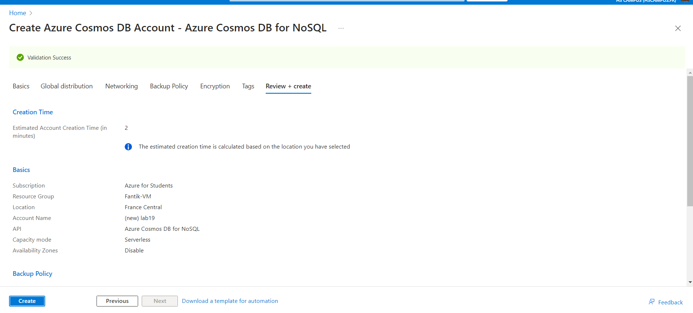
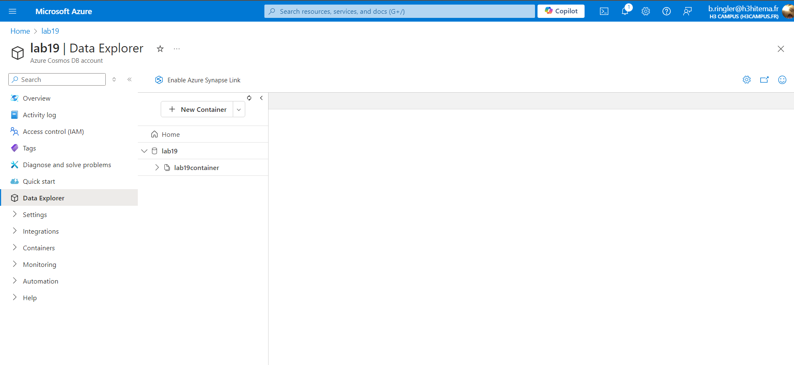
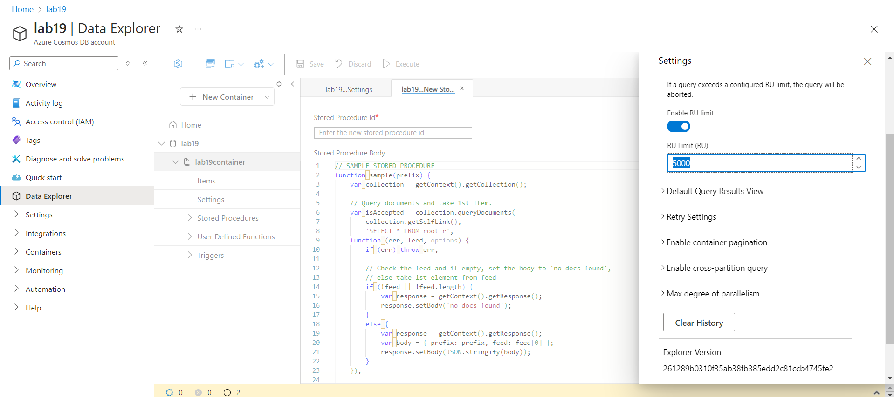
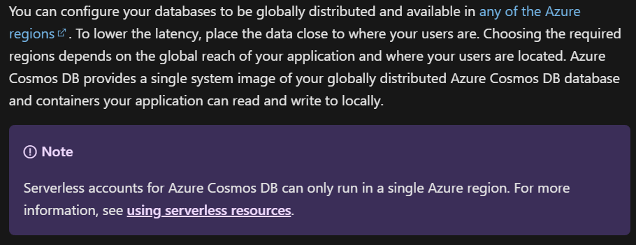

# Lab 19: Implementing Azure Cosmos DB


## Étape 1 : Créer un compte Cosmos DB avec une API choisie

1. Créez un compte Cosmos DB dans le portail Azure avec l'API **SQL**, **MongoDB**, ou autre.

**Capture d’écran** : 

### Commande équivalente (Azure CLI)
```bash
az cosmosdb create     --resource-group <nom_du_groupe>     --name <nom_du_compte_cosmosdb>     --kind MongoDB     --locations regionName=<region>     --default-consistency-level "Session"
```

---

## Étape 2 : Insérer et interroger des données avec Data Explorer

1. Utilisez **Data Explorer** pour créer une base de données, un container, et insérer des documents JSON.

**Capture d’écran** : 

### Commande équivalente (Azure CLI)
```bash
az cosmosdb mongodb database create     --account-name <nom_du_compte_cosmosdb>     --resource-group <nom_du_groupe>     --name <nom_base_de_donnees>
    
az cosmosdb mongodb collection create     --account-name <nom_du_compte_cosmosdb>     --resource-group <nom_du_groupe>     --database-name <nom_base_de_donnees>     --name <nom_du_container>
```

---

## Étape 3 : Configurer le débit et le partitionnement

1. Configurez le débit (RU/s) pour votre base de données ou votre container et choisissez une clé de partitionnement.

**Capture d’écran** : 

### Commande équivalente (Azure CLI)
```bash
az cosmosdb mongodb collection throughput update     --account-name <nom_du_compte_cosmosdb>     --resource-group <nom_du_groupe>     --database-name <nom_base_de_donnees>     --name <nom_du_container>     --throughput 400
```

---

## Étape 4 : Mettre en œuvre la distribution globale

1. **Note**: Je n'ai pas pu faire cette partie car je suis en serverless...

**Capture d’écran** : 

### Commande équivalente (Azure CLI)
```bash
# En mode provisionné, vous pouvez ajouter une région de distribution globale comme ceci :
az cosmosdb failover-priority-change     --resource-group <nom_du_groupe>     --name <nom_du_compte_cosmosdb>     --failover-policies EastUS=0 WestEurope=1
```

---

