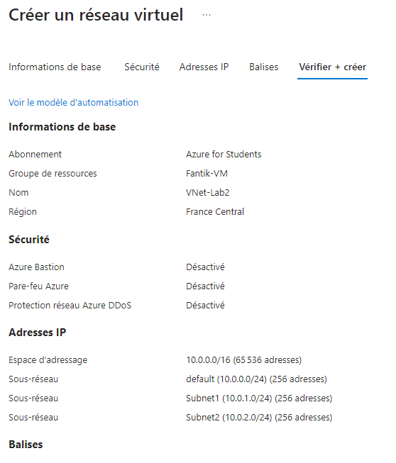
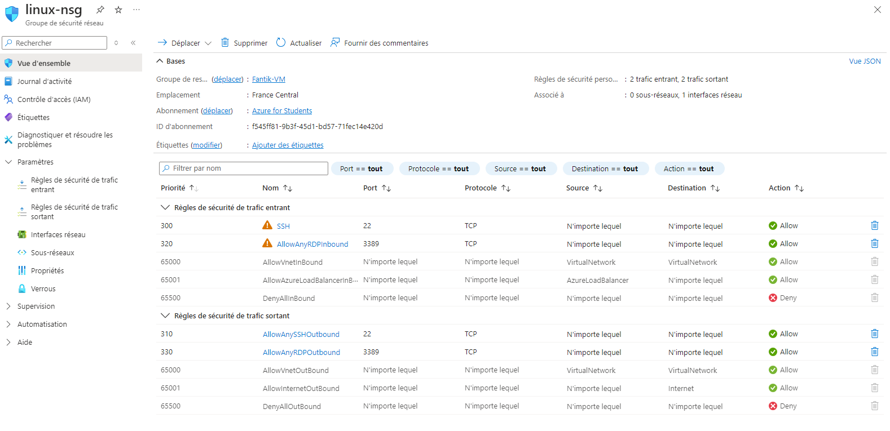
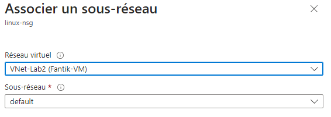
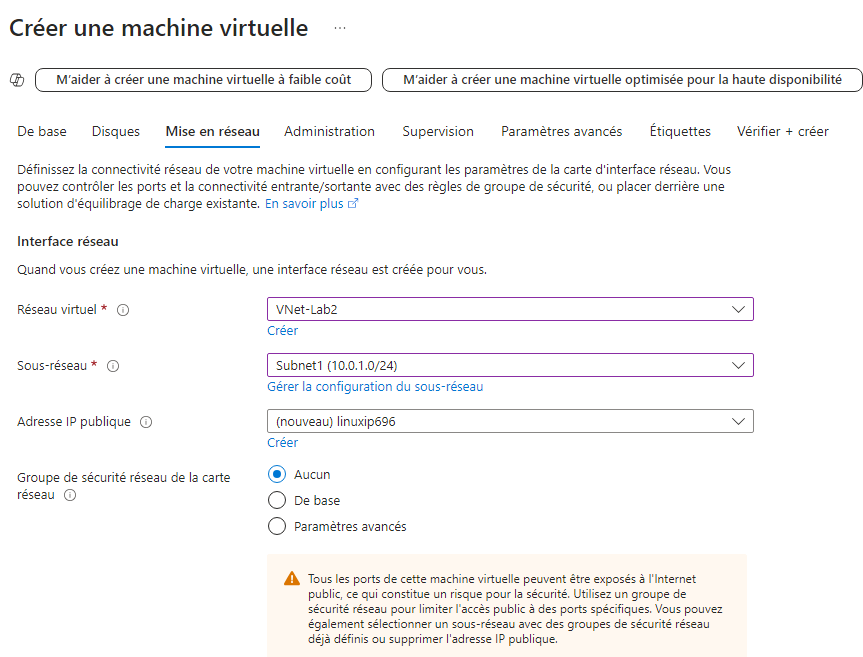
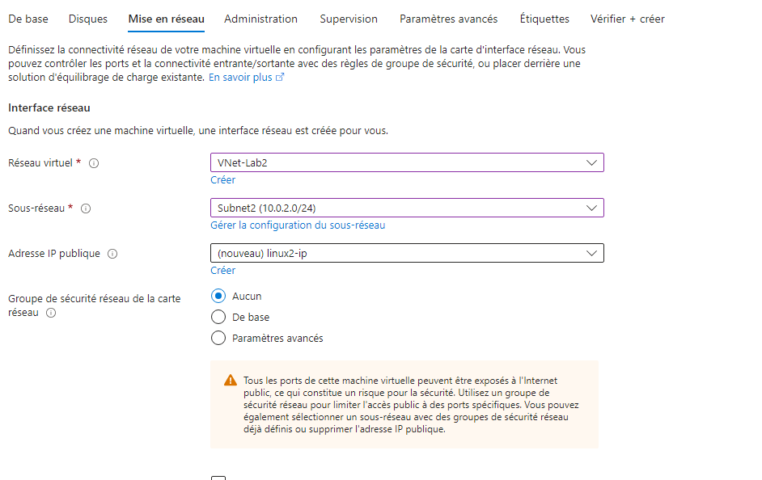
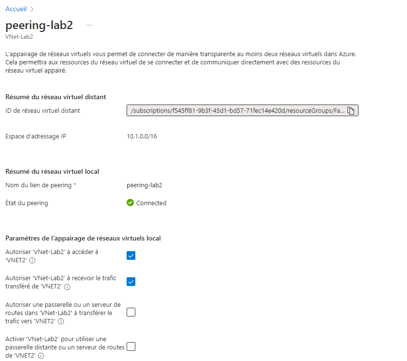

# Lab 2: Implementing Azure Virtual Networks

## Étape 1 : Création d'un VNet avec plusieurs sous-réseaux

1. Dans le portail Azure, créez un **Virtual Network** avec deux sous-réseaux :
    - *VNet Name* : `VNet-Lab2`
    - *Address Space* : `10.0.0.0/16`
    - *Subnet1* : `10.0.1.0/24`
    - *Subnet2* : `10.0.2.0/24`



### Commande équivalente (Azure CLI)
```bash
az network vnet create \
  --name VNet-Lab2 \
  --resource-group <nom_du_groupe> \
  --address-prefix 10.0.0.0/16 \
  --subnet-name Subnet1 \
  --subnet-prefix 10.0.1.0/24

az network vnet subnet create \
  --vnet-name VNet-Lab2 \
  --name Subnet2 \
  --address-prefix 10.0.2.0/24 \
  --resource-group <nom_du_groupe>
```

---

## Étape 2 : Configuration des Network Security Groups (NSG)

1. Créez un **NSG** et configurez les règles pour autoriser le trafic SSH (port 22) et RDP (port 3389).



### Commande équivalente (Azure CLI)
```bash
az network nsg create \
  --resource-group <nom_du_groupe> \
  --name NSG-Lab2

az network nsg rule create \
  --resource-group <nom_du_groupe> \
  --nsg-name NSG-Lab2 \
  --name Allow-SSH \
  --priority 1000 \
  --direction Inbound \
  --access Allow \
  --protocol Tcp \
  --destination-port-ranges 22

az network nsg rule create \
  --resource-group <nom_du_groupe> \
  --nsg-name NSG-Lab2 \
  --name Allow-RDP \
  --priority 1001 \
  --direction Inbound \
  --access Allow \
  --protocol Tcp \
  --destination-port-ranges 3389
```

---

## Étape 3 : Déploiement de VMs dans des sous-réseaux spécifiques

1. Déployez une première VM dans le sous-réseau **Subnet1** et une deuxième VM dans **Subnet2**.



### Commande équivalente (Azure CLI)
```bash
az vm create \
  --resource-group <nom_du_groupe> \
  --name VM-Subnet1 \
  --image UbuntuLTS \
  --admin-username <votre_nom_d_utilisateur> \
  --authentication-type ssh \
  --ssh-key-value <clé_publique_ssh> \
  --vnet-name VNet-Lab2 \
  --subnet Subnet1

az vm create \
  --resource-group <nom_du_groupe> \
  --name VM-Subnet2 \
  --image UbuntuLTS \
  --admin-username <votre_nom_d_utilisateur> \
  --authentication-type ssh \
  --ssh-key-value <clé_publique_ssh> \
  --vnet-name VNet-Lab2 \
  --subnet Subnet2
```

---

## Étape 4 : Configuration du peering entre deux VNets

1. Configurez le peering entre **VNet-Lab2** et un autre VNet :
    - Sélectionnez le VNet cible et configurez les options **Allow Gateway Transit** et **Allow Forwarded Traffic** si nécessaire.






### Commande équivalente (Azure CLI)
```bash
az network vnet peering create \
  --name VNet2toVNet1 \
  --resource-group <nom_du_groupe> \
  --vnet-name VNet-Lab2 \
  --remote-vnet <vnet-id-de-l-autre-VNet> \
  --allow-vnet-access
```

---
