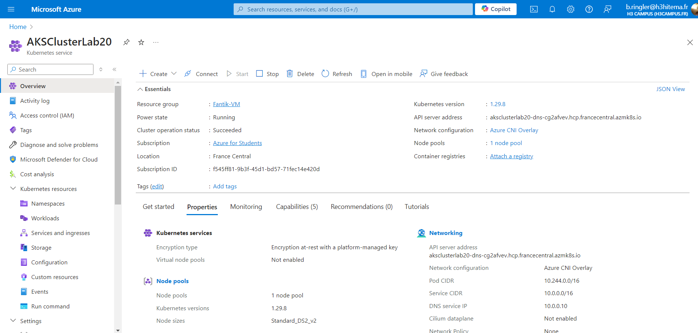
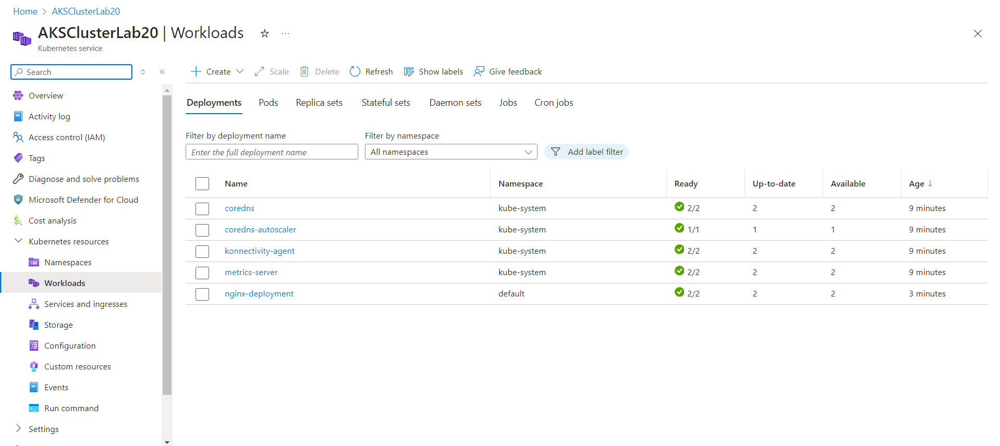
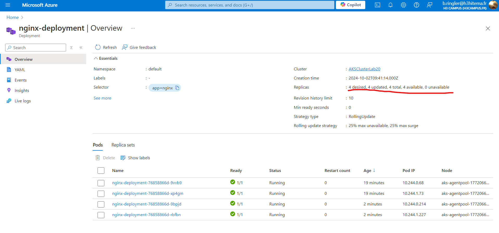
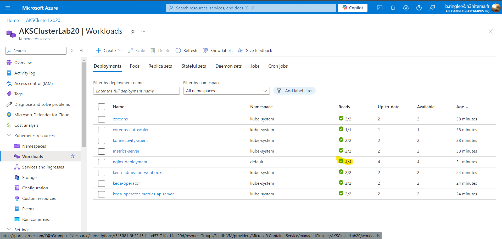
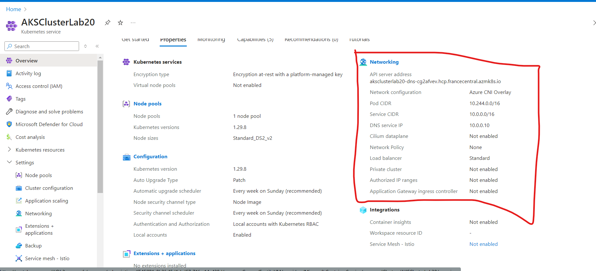
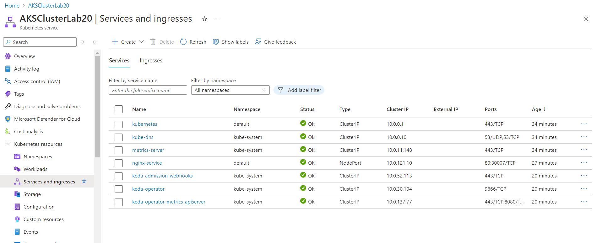

# Lab 20: Deploying Azure Kubernetes Service (AKS)


## Étape 1 : Configurer un cluster AKS

1. Créez un cluster AKS dans le portail Azure. Les paramètres du cluster peuvent être configurés via l'interface graphique.

**Capture d’écran** : 

   ```bash
   az aks create \
     --resource-group <nom_du_groupe> \
     --name AKSClusterLab20 \
     --node-count 3 \
     --enable-addons monitoring \
     --generate-ssh-keys
   ```

---

## Étape 2 : Déployer une application conteneurisée à l'aide de manifestes Kubernetes

1. Téléchargez les fichiers `deployment.yaml` et `service.yaml` dans la section **Kubernetes resources** du portail Azure.
2. Utilisez l'option **Apply** pour déployer l'application conteneurisée.

Voici les fichiers YAML utilisés :

### `deployment.yaml`
```yaml
apiVersion: apps/v1
kind: Deployment
metadata:
  name: nginx-deployment
spec:
  replicas: 2
  selector:
    matchLabels:
      app: nginx
  template:
    metadata:
      labels:
        app: nginx
    spec:
      containers:
      - name: nginx
        image: nginx:1.21
        ports:
        - containerPort: 80
```

### `service.yaml`
```yaml
apiVersion: v1
kind: Service
metadata:
  name: nginx-service
spec:
  selector:
    app: nginx
  ports:
  - protocol: TCP
    port: 80
    targetPort: 80
    nodePort: 30007
  type: NodePort
```

---

## Étape 3 : Mettre à l'échelle les applications et gérer les pods

1. Dans l'interface **Kubernetes resources**, ajustez le nombre de réplicas à partir du déploiement en modifiant les paramètres.

**Capture d’écran** : 
**Capture d’écran** : 
**Capture d’écran** : 

   ```bash
   kubectl scale --replicas=4 deployment/nginx-deployment
   ```

      ```bash
   kubectl get pods
   ```


---

## Étape 4 : Mettre en œuvre des politiques réseau pour la communication entre pods

1. Appliquez les politiques réseau en téléchargeant le fichier `networkpolicy.yaml` et en utilisant l'option **Apply**.


**Capture d’écran** : 
**Capture d’écran** : 


---


