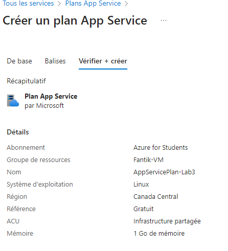
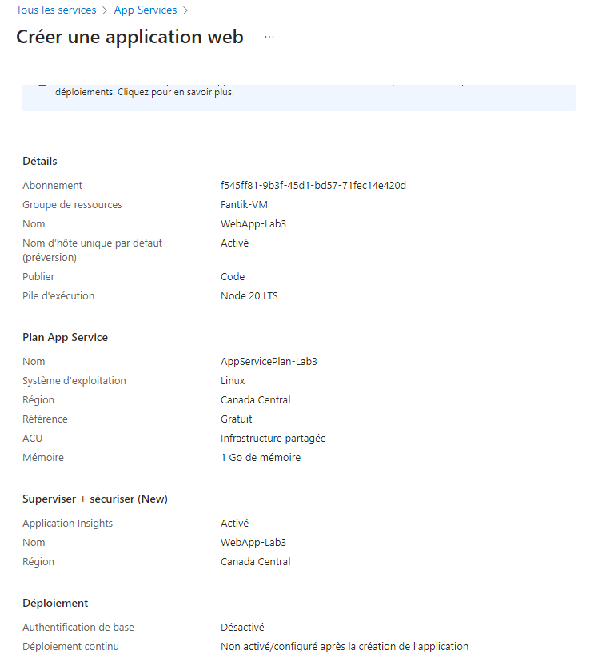
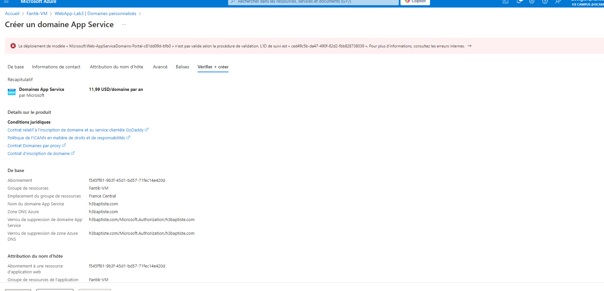
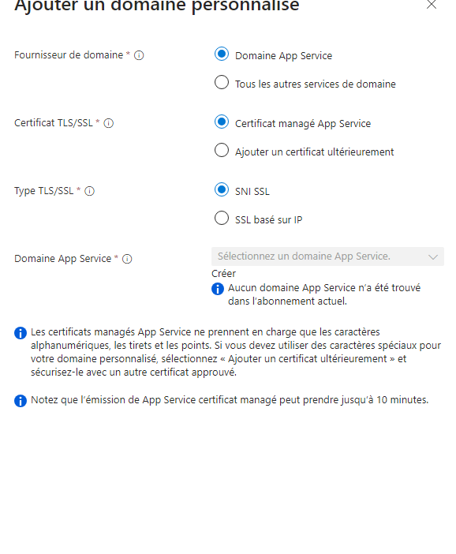
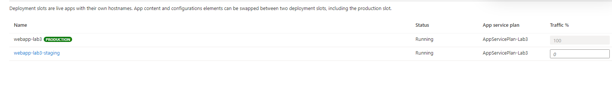

# Lab 3: Deploying Azure App Service Web Apps


## Étape 1 : Création d'un App Service Plan

1. Créez un **App Service Plan** dans le portail Azure :
   - *Name* : `AppServicePlan-Lab3`
   - *Operating System* : Linux ou Windows
   - *Region* : Sélectionner la région préférée
   - *Pricing Tier* : Free ou Standard selon les besoins




### Commande équivalente (Azure CLI)
```bash
az appservice plan create \
  --name AppServicePlan-Lab3 \
  --resource-group <nom_du_groupe> \
  --sku F1 \
  --is-linux
```

---

## Étape 2 : Déployer une application Web

1. Déployez une application Web via le portail Azure :
   - *App Name* : `WebApp-Lab3`
   - *Runtime Stack* : Choisir une technologie comme Node.js, Python, .NET, etc.
   - *Region* : Utilisez la même région que votre App Service Plan.



### Commande équivalente (Azure CLI)
```bash
az webapp create \
  --resource-group <nom_du_groupe> \
  --plan AppServicePlan-Lab3 \
  --name WebApp-Lab3 \
  --runtime "NODE|14-lts"
```

---

## Étape 3 : Configurer un domaine personnalisé et SSL

1. Ajoutez un domaine personnalisé dans les paramètres de l'App Service et configurez un certificat SSL.

---
Des problèmes ici de mon coté : 




### Commande équivalente (Azure CLI)
Pour ajouter un domaine personnalisé :
```bash
az webapp config hostname add \
  --resource-group <nom_du_groupe> \
  --webapp-name WebApp-Lab3 \
  --hostname <nom_domaine_personnalisé>
```

Pour configurer un certificat SSL :
```bash
az webapp config ssl upload \
  --certificate-file <chemin_certificat> \
  --certificate-password <mot_de_passe> \
  --name WebApp-Lab3 \
  --resource-group <nom_du_groupe>
```

---

## Étape 4 : Implémenter des slots de déploiement

1. Créez un slot de mise en scène (staging) :
   - *Slot Name* : `Staging`
   - Clonez la configuration de production pour tester les mises à jour avant la mise en production.




### Commande équivalente (Azure CLI)
```bash
az webapp deployment slot create \
  --resource-group <nom_du_groupe> \
  --name WebApp-Lab3 \
  --slot staging \
  --configuration-source WebApp-Lab3
```

Pour effectuer un **swap** entre les slots staging et production :
```bash
az webapp deployment slot swap \
  --resource-group <nom_du_groupe> \
  --name WebApp-Lab3 \
  --slot staging
```

---

