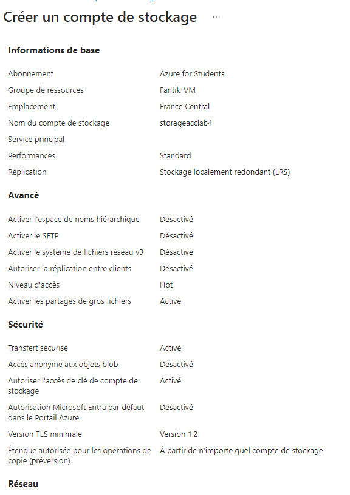

# Lab 4: Managing Azure Storage Accounts and Blobs


## Étape 1 : Création d'un Storage Account avec des options de réplication

1. Créez un **Storage Account** dans le portail Azure :
   - *Name* : `storagelab4`
   - *Region* : Choisissez une région appropriée
   - *Replication* : Sélectionnez LRS ou GRS selon vos besoins

**Capture d’écran** : 

### Commande équivalente (Azure CLI)
```bash
az storage account create \
  --name storagelab4 \
  --resource-group <nom_du_groupe> \
  --location <region> \
  --sku Standard_LRS
```

---

## Étape 2 : Téléverser et gérer des blobs

1. Téléverser un fichier blob dans un conteneur via le portail Azure :
   - Créez un conteneur et téléversez des fichiers dans le conteneur.

**Capture d’écran** : 

### Commande équivalente (Azure CLI)
```bash
# Créer un conteneur
az storage container create \
  --account-name storagelab4 \
  --name mycontainer

# Téléverser un fichier blob
az storage blob upload \
  --account-name storagelab4 \
  --container-name mycontainer \
  --file <chemin_fichier> \
  --name <nom_blob>
```

---

## Étape 3 : Configurer une Shared Access Signature (SAS)

1. Générez une SAS pour sécuriser l'accès à un blob ou un conteneur dans le portail Azure.

**Capture d’écran** : 

### Commande équivalente (Azure CLI)
```bash
az storage blob generate-sas \
  --account-name storagelab4 \
  --container-name mycontainer \
  --name <nom_blob> \
  --permissions r \
  --expiry 2024-12-31T23:59:00Z \
  --https-only
```

---

## Étape 4 : Implémenter des politiques de gestion du cycle de vie

1. Configurez des règles de cycle de vie pour archiver ou supprimer des blobs après une certaine période.

**Capture d’écran** : 

### Commande équivalente (Azure CLI)
Pour configurer une politique de gestion du cycle de vie (actuellement, cela nécessite JSON via l’Azure CLI ou Portal) :
```bash
az storage account management-policy create \
  --account-name storagelab4 \
  --resource-group <nom_du_groupe> \
  --policy @<fichier_policy.json>
```

---

