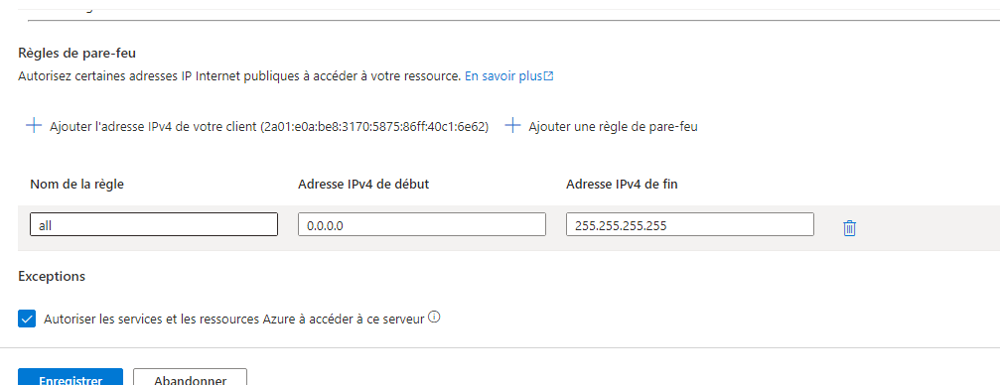

# Lab 5: Implementing Azure SQL Databases


## Étape 1 : Déployer une instance SQL Azure

1. Créez une **SQL Database** dans le portail Azure :
   - *Database Name* : `sqlDBLab5`
   - *Server* : Créez un nouveau serveur SQL
   - *Pricing Tier* : Choisissez Basic ou Standard selon vos besoins

**Capture d’écran** : 

### Commande équivalente (Azure CLI)
```bash
az sql db create \
  --resource-group <nom_du_groupe> \
  --name sqlDBLab5 \
  --server <nom_du_serveur> \
  --edition Basic
```

---

## Étape 2 : Configurer les paramètres de pare-feu

1. Configurez les paramètres de pare-feu pour autoriser l'accès depuis des adresses IP spécifiques dans le portail Azure.

**Capture d’écran** : 

### Commande équivalente (Azure CLI)
```bash
az sql server firewall-rule create \
  --resource-group <nom_du_groupe> \
  --server <nom_du_serveur> \
  --name AllowYourIP \
  --start-ip-address <votre_adresse_IP> \
  --end-ip-address <votre_adresse_IP>
```

---

## Étape 3 : Importer des données dans la base de données

1. Importez des données dans la base de données via **Azure Data Studio** ou **SQL Server Management Studio (SSMS)**.


### Commande équivalente (SQL CLI)
```bash
bcp <database.schema.table> in <file.csv> -S <server>.database.windows.net -d <database> -U <username> -P <password> -c -t ,
```

---

## Étape 4 : Implémenter la géo-réplication

1. Activez la géo-réplication pour assurer une haute disponibilité dans une région secondaire.

**Capture d’écran** : 

### Commande équivalente (Azure CLI)
```bash
az sql db replica create \
  --name sqlDBLab5 \
  --resource-group <nom_du_groupe> \
  --server <nom_du_serveur> \
  --partner-server <nom_serveur_replication> \
  --partner-resource-group <nom_du_groupe>
```

---

