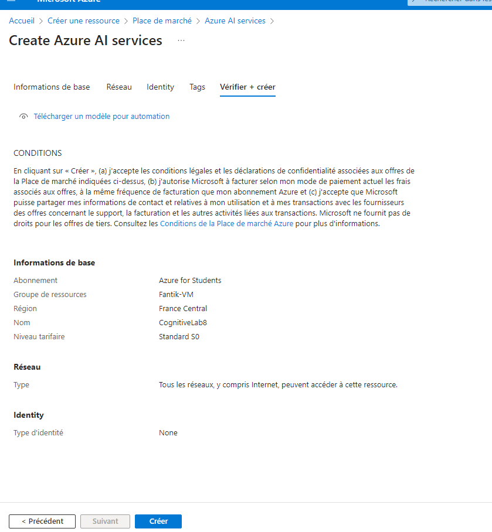

# Lab 8: Using Azure Cognitive Services


## Étape 1 : Créer une ressource Cognitive Services

1. Créez une ressource **Cognitive Services** dans le portail Azure :
   - *Name* : `CognitiveLab8`
   - *Pricing Tier* : Standard S0


**Capture d’écran** : 


### Commande Azure CLI équivalente :
```bash
az cognitiveservices account create \
  --name CognitiveLab8 \
  --resource-group <nom_du_groupe> \
  --kind TextAnalytics \
  --sku S0 \
  --location <region> \
  --yes
```

---

## Étape 2 : Développer une application qui utilise l'API Text Analytics

1. Utilisez l'API **Text Analytics** pour analyser des sentiments et des phrases clés. Le code ci-dessous montre comment appeler l'API à partir d'un script Python.

### Code Python pour appeler l'API Text Analytics :
```python
import requests

# Informations de connexion à l'API
subscription_key = "accec0862d234731b54a32b679bf46e3"
endpoint = "https://cognitivelab8.cognitiveservices.azure.com/"
path = "/text/analytics/v3.0/sentiment"

def get_sentiment(text):
    headers = {"Ocp-Apim-Subscription-Key": subscription_key}
    documents = {"documents": [{"id": "1", "text": text}]}
    response = requests.post(endpoint + path, headers=headers, json=documents)
    return response.json()

# Exemple d'analyse de sentiment
text = "Azure Cognitive Services are amazing!"
result = get_sentiment(text)
print(result)
```

### Exécution :
1. Installez la bibliothèque Python `requests` si elle n'est pas déjà installée :
   ```bash
   pip install requests
   ```
2. Exécutez le script **`text_analysis.py`** dans votre environnement Python pour envoyer une requête à l'API et analyser le texte :
   ```bash
   python text_analysis.py
   ```

---

## Étape 3 : Analyser les résultats de l'API

1. Utilisez l'application pour analyser des sentiments et des phrases clés à partir de textes d'exemple. Le résultat de l'API sera imprimé en JSON, contenant le score de sentiment (positif, négatif, neutre) pour chaque document analysé.

---
